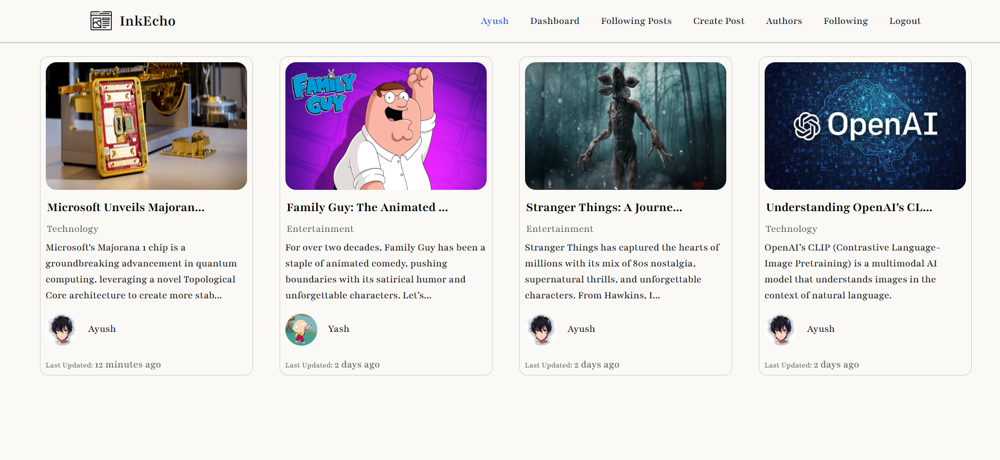

# InkEcho 🖋️📢

Welcome to **InkEcho**, a modern blog application built with the **MERN** stack. Designed for both developers and writers, this project is an educational tool to explore **web development** and **DevOps** practices.

---

  

---

## 🚀 Features

- 📝 **Create, Edit & Delete Posts**
- 👤 **User Profiles**
- 📢 **Follow Your Favorite Authors**
- 🌎 **Caddy Reverse Proxy Integration**
- 🐳 **Docker-Compose for Easy Setup**
- 🔄 **Development & Production Ready**
- 🎓 **Learn Web Development & DevOps**

## 🌍 Live Demo

InkEcho is hosted at: [**www.inkecho.com**](https://www.inkecho.com)

---

## 📦 Installation & Setup

InkEcho is fully containerized using **Docker** and can be easily set up for both development and production environments.

### 🔧 Development Setup
To run the project in development mode:
```sh
docker-compose -f docker-compose.dev.yml up --build
```

### 🚀 Production Setup
To deploy the project in production mode:
```sh
docker-compose -f docker-compose.yml up --build
```

---

## 🤝 Contributing
InkEcho is an **open-source** project, and contributions are **highly encouraged!** Feel free to submit pull requests, open issues, or suggest new features.

---

## 📜 License
This project is licensed under the **MIT License**. Feel free to use, modify, and distribute it as you see fit.

---

Happy coding! 🚀
